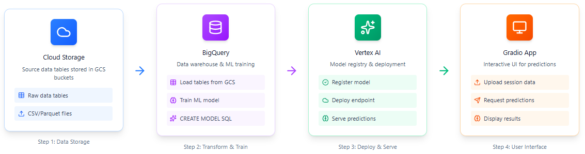
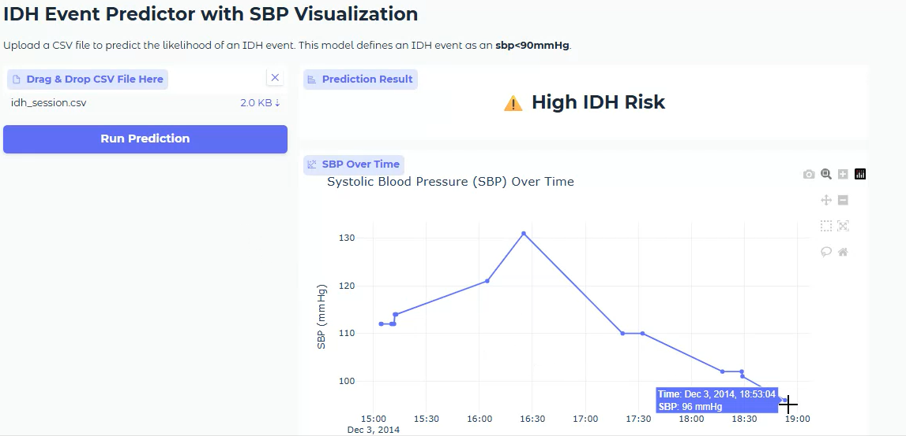

# IDH Prediction Platform 🩸  
**End-to-end MLOps prototype for predicting intradialytic hypotension (IDH) on Google Cloud**

This repository showcases a full machine-learning pipeline for clinical risk prediction of IDH — from **data ingestion** and **feature engineering** in BigQuery to **model deployment** on Vertex AI and a **Gradio web UI** for interactive inference — all in under one hour.

> 🧠 **Tech stack:** Python · BigQuery · Vertex AI · Cloud Storage · GitHub Actions · Gradio · Docker  
> ⚙️ **Focus:** reproducible MLOps, cloud orchestration, and interpretable healthcare AI  
> 🩺 **Dataset:** [Nature Scientific Data 2019 – Blood pressure prediction for chronic hemodialysis](https://www.nature.com/articles/s41597-019-0319-8)

---

## 🚀 Quick Overview

This project demonstrates how to:

- **Provision** data infrastructure on Google Cloud (BigQuery + Cloud Storage)  
- **Engineer features** and **train models with (AUC = ~0.90)** directly within BigQuery  
- **Deploy** the trained model to **Vertex AI Endpoints** for online inference  
- **Interact** with predictions through a **Gradio web app** showing systolic BP trends and IDH risk  

The repository is organised as a Python package (`idh`) so components can be reused across CLI tools and the web UI.



---

## 🧩 How to Use This Template

This repo is a **template**, designed for anyone to fork and reproduce the full pipeline within their own Google Cloud project.

### 1️⃣ Fork the template
Click **Use this template** above to create your own copy. 
> ⚠️ Keep the repository private to ensure your credentials remain secure.


### 2️⃣ Add your Google Cloud credentials
1. Create a GCP service account with Vertex AI, BigQuery, and Storage permissions  
   (`roles/aiplatform.admin`, `roles/bigquery.admin`, `roles/storage.admin`).  
2. Download the JSON key.  
3. In your new repo, go to **Settings → Secrets → Actions → New repository secret**  
   - Name: `GOOGLE_CLOUD_CREDENTIALS`  
   - Value: (contents of your key JSON)

### 3️⃣ Run the GitHub Action
From the **Actions** tab, run **Train and Deploy Model** and provide:
- `project_name` – your GCP project ID (must refer to an existing, globally unique GCP project ID)  
- `bucket` – your Cloud Storage bucket name (must be globally unique across all of GCP)
- `region` – (optional) default `us-central1`
- `model_name` – (optional) default `idh-xgboost-model`

The workflow will automatically:
1. Enable Vertex AI / BigQuery APIs  
2. Prepare training data  
3. Train the model  
4. Deploy it to a Vertex AI endpoint  
5. Create a results artifact that can be downloaded from the workflow run.

---

## 💻 Run the Gradio App Locally

To run the app locally after deploying your model to Vertex AI:

### 1️⃣ Clone and install

```bash
git clone https://github.com/SamMaksoud8/idh-prediction.git
cd idh-prediction
pip install -e .
```

### 2️⃣ Configure environment variables

Set your project-specific environment variables:

```bash
# Required
export PROJECT_NAME="idh-prediction"              # your GCP project ID
export BUCKET="idh-prototype-data"                # your Cloud Storage bucket (must be globally unique)

# Optional
export REGION="us-central1"                       # default region
export MODEL_NAME="idh-xgboost-model"             # optional Vertex AI model name`
```
> 💡 These values should match the ones used during your GitHub Action deployment.

### 3️⃣ Authenticate with Google Cloud

Point your environment to the service account key file you used for deployment:

```bash
export GOOGLE_APPLICATION_CREDENTIALS=".keys/idh-prediction.json"
```

If you haven't already authenticated for CLI use:

```bash
gcloud auth activate-service-account --key-file="$GOOGLE_APPLICATION_CREDENTIALS"
```

### 4️⃣ Launch the Gradio app

```bash
python src/idh/app/csv_prediction.py
```

Visit <http://localhost:8080> to upload a dialysis CSV and view:

-   Systolic blood pressure (SBP) time-series plot

-   IDH risk prediction (⚠️ High / ✅ Low)

Example test files are available under `sample_data/`.



---

## 🧠 For Reviewers

This project illustrates:
* MLOps automation using GitHub Actions and GCP APIs
* Cloud-native feature engineering via BigQuery SQL pipelines
* Vertex AI model lifecycle: training → registry → endpoint deployment
* Secure configuration with environment variables and secrets
* Human-centred ML UI for interpretability and validation

It’s intended as a portfolio demonstration of end-to-end ML engineering, not for clinical use.

## 🗂️ Repository Structure
```bash
├── config.yaml              # Default project/dataset/model config
├── sample_data/             # Example dialysis session CSVs
├── scripts/                 # CLI helpers for prep, training, deploy, predict
├── src/idh/                 # Python package (data, model, gcp, app modules)
└── requirements.txt         # Runtime dependencies
```

Key modules:
* idh.config – loads YAML + .env overrides
* idh.data – data ingestion & feature generation
* idh.model – payload builders & Vertex AI inference helpers
* idh.gcp – BigQuery / Storage utilities
* idh.app – Gradio UI for predictions


## ⚠️ Disclaimer

This repository is for educational and portfolio demonstration purposes only.
It is not a certified medical device and should not be used for clinical decision-making.
